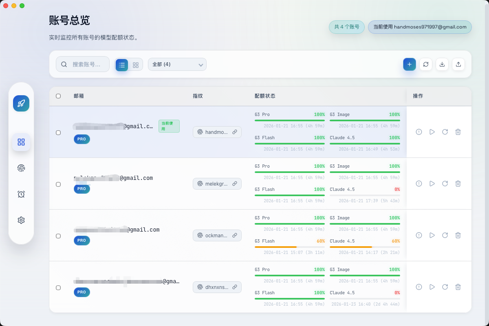
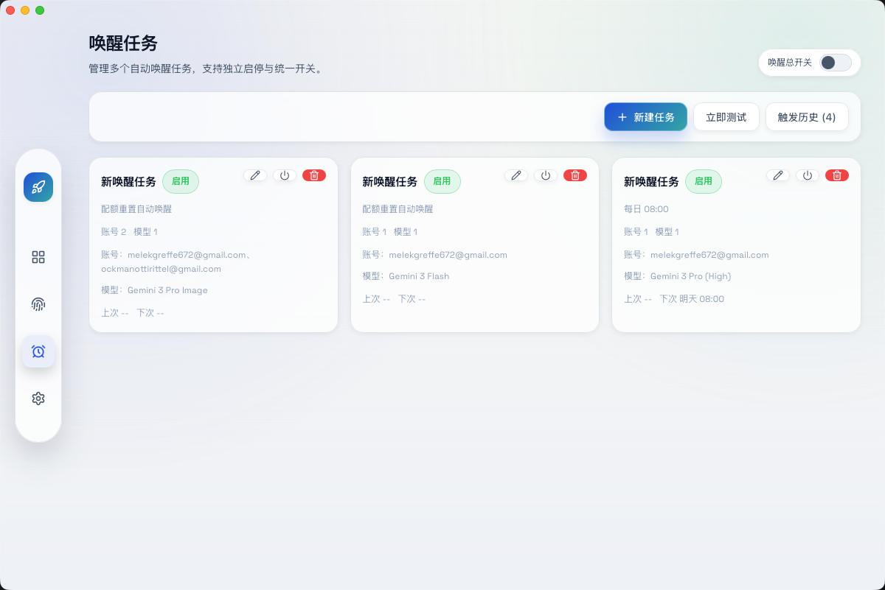
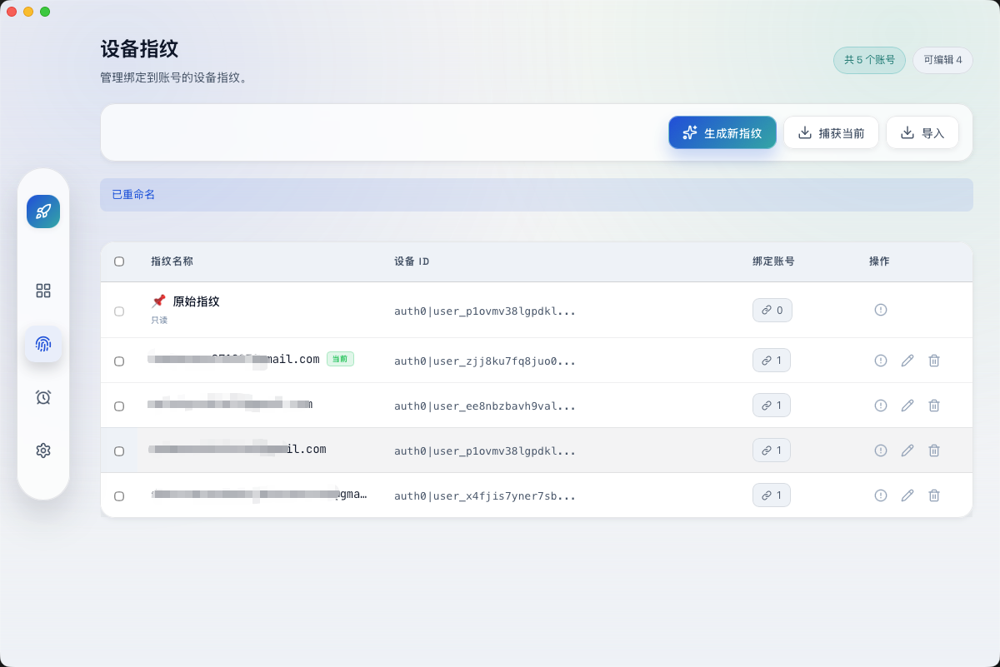

# Antigravity Cockpit Tools

English · [简体中文](README.md)

[](https://github.com/jlcodes99/antigravity-cockpit-tools)
[](https://github.com/jlcodes99/antigravity-cockpit-tools/issues)
[](https://github.com/jlcodes99/antigravity-cockpit-tools)

A desktop multi-account management tool **designed specifically for Antigravity client users**.

> ⚠️ **Note**: This tool requires the local Antigravity client to be installed. The core feature is **one-click account switching**, helping users quickly switch between multiple accounts, reduce the risk of account switching, and fully utilize quotas from different accounts.

**Features**: One-click Switch · Multi-account Management · Quota Monitoring · Wake-up Tasks · Device Fingerprints · Plugin Integration

**Languages**: Supports 16 languages

🇺🇸 English · 🇨🇳 简体中文 · 繁體中文 · 🇯🇵 日本語 · 🇩🇪 Deutsch · 🇪🇸 Español · 🇫🇷 Français · 🇮🇹 Italiano · 🇰🇷 한국어 · 🇧🇷 Português · 🇷🇺 Русский · 🇹🇷 Türkçe · 🇵🇱 Polski · 🇨🇿 Čeština · 🇸🇦 العربية · 🇻🇳 Tiếng Việt

---

## Feature Overview

### One-Click Account Switching (Core Feature)



The core feature of this tool is **one-click account switching**, helping users quickly switch between multiple Antigravity accounts:

- **Quick Switch**: One-click switch the currently active account, no manual login/logout required
- **Multiple Import Methods**: OAuth authorization, Refresh Token, sync from plugin, import from JSON
- **Batch Operations**: Batch refresh quotas, batch delete, batch export
- **Card/List View**: Two view modes, switch as needed
- **Quota Display**: Real-time view of remaining quota and reset time for each model

---

### Wake-up Tasks



Schedule AI model wake-ups to trigger quota reset cycles in advance:

- **Multiple Trigger Modes**:
  - Scheduled: Daily / Weekly / Interval loop
  - Crontab advanced mode
  - Quota reset trigger
- **Multi-model Support**: Wake up multiple models simultaneously
- **Multi-account Support**: Specify multiple accounts for task execution
- **Time Window**: Restrict tasks to run only within specified time periods
- **History Records**: View detailed trigger logs and AI responses
- **Test Run**: Manually test wake-up effects

---

### Device Fingerprints



Manage device fingerprints bound to accounts:

- **Generate Fingerprint**: Randomly generate new device fingerprints
- **Capture Current**: Capture the fingerprint currently used by the client
- **Bind Accounts**: Bind fingerprints to multiple accounts
- **Import/Export**: Support importing from legacy tools or JSON
- **Batch Management**: Batch delete fingerprints

---

### Quota Monitoring

Real-time monitoring of model quotas for each account:

- **Multi-model Display**: Shows popular models (Claude Sonnet, Gemini Pro, Gemini Flash, etc.)
- **Quota Progress Bar**: Visualize remaining quota percentage
- **Reset Countdown**: Display remaining time until quota reset
- **Color Indicators**: Green/Yellow/Red three-tier reminder

---

### Plugin Integration

Supports integration with [Antigravity Cockpit](https://github.com/jlcodes99/vscode-antigravity-cockpit) VS Code extension:

- **Switch from Plugin**: Directly call Tools from within the VS Code extension for quick account switching, without leaving the editor
- **Account Sync**: Sync authorized accounts from the plugin to Tools
- **Current Account Sync**: Automatically sync the current account used by the local client
- **Two-way Communication**: Real-time communication with the plugin

---

## Screenshots

| Account Overview | Wake-up Tasks |
| :---: | :---: |
|  |  |

| Device Fingerprints | - |
| :---: | :---: |
|  | - |

---

## Installation

### Download Release

Download the installer for your platform from the [Releases](https://github.com/jlcodes99/antigravity-cockpit-tools/releases) page:

- **macOS**: `.dmg` or `.app`
- **Windows**: `.msi` or `.exe`
- **Linux**: `.deb`, `.rpm`, or `.AppImage`

---

## Quick Start

1. Download and install the release package
2. Add accounts (OAuth / Refresh Token / Sync from Plugin / JSON Import)
3. View quotas and status in "Account Overview"
4. Create wake-up tasks to schedule model wake-ups
5. Manage device fingerprints (optional)

---

## Development & Build

### Prerequisites

- Node.js v18+
- npm v9+
- Rust (Tauri runtime)

### Install Dependencies

```bash
npm install
```

### Development Mode

```bash
npm run tauri dev
```

### Build

```bash
npm run tauri build
```

---

## Tech Stack

- **Frontend**: React 19 + TypeScript + Vite
- **Backend**: Tauri 2 (Rust)
- **Internationalization**: i18next + react-i18next
- **State Management**: Zustand
- **Styling**: TailwindCSS + DaisyUI

---

## Acknowledgments

- Account switching logic based on: [Antigravity-Manager](https://github.com/lbjlaq/Antigravity-Manager)

Thanks to the project author for their open-source contributions! If these projects have helped you, please give them a ⭐ Star to show your support!


---

## Support

- ⭐ [GitHub Star](https://github.com/jlcodes99/antigravity-cockpit-tools)
- 💬 [Report Issues](https://github.com/jlcodes99/antigravity-cockpit-tools/issues)

---


## License

[MIT](LICENSE)

---

## Disclaimer

This project is for personal learning and research purposes only. By using this project, you agree to:

- Not use this project for any commercial purposes
- Bear all risks and responsibilities of using this project
- Comply with relevant terms of service and laws and regulations

The project author is not responsible for any direct or indirect losses arising from the use of this project.
